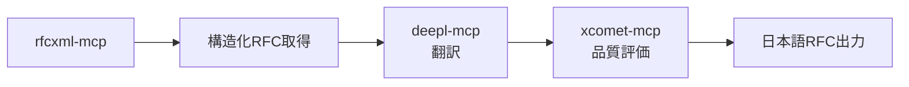

# RFCXML MCP Server - 開発ガイド

## プロジェクト概要

### 目的

RFC文書を**構造的に理解**するためのMCPサーバー。既存の`mcp-rfc`がテキストベースなのに対し、RFCXMLの意味構造を活用してAIと人間の両方がRFCを正確に理解・検証できるようにする。

### レイヤー構造

```
┌─────────────────────────┐
│  Markdown / PDF         │  表示・共有
├─────────────────────────┤
│  翻訳                   │  説明・検証・普及
├─────────────────────────┤
│  RFCXML MCP             │  AI と人の共通理解基盤 ← このプロジェクト
├─────────────────────────┤
│  RFCXML                 │  唯一の真実（Single Source of Truth）
└─────────────────────────┘
```

### 既存MCPとの差別化

| 機能 | 既存 mcp-rfc | RFCXML MCP |
|------|-------------|------------|
| RFC テキスト取得 | ✅ | ✅ |
| セクション抽出 | テキストベース | **構造ベース** |
| MUST/SHOULD/MAY 抽出 | ❌ | ✅ |
| 条件・例外の構造化 | ❌ | ✅ |
| RFC 間依存グラフ | ❌ | ✅ |
| 定義スコープ管理 | ❌ | ✅ |
| 実装チェックリスト | ❌ | ✅ |

---

## ファイル構成

```
rfcxml-mcp/
├── src/
│   ├── index.ts                 # MCPサーバーエントリポイント
│   ├── services/
│   │   ├── rfc-fetcher.ts       # RFC XML 取得・キャッシュ
│   │   └── rfcxml-parser.ts     # RFCXML パーサー
│   ├── tools/
│   │   ├── definitions.ts       # MCPツール定義
│   │   └── handlers.ts          # ツールハンドラー実装
│   └── types/
│       └── index.ts             # 型定義
├── package.json
├── tsconfig.json
└── README.md
```

---

## ツール一覧と状態

### Phase 1: 基本構造
| ツール | 説明 | 状態 |
|--------|------|------|
| `get_rfc_structure` | セクション階層とメタデータ取得 | ✅ 動作 |
| `get_requirements` | 規範性要件（MUST/SHOULD/MAY）抽出 | ✅ 動作 |
| `get_definitions` | 用語定義とスコープ | ✅ 動作 |

### Phase 2: 関係性
| ツール | 説明 | 状態 |
|--------|------|------|
| `get_rfc_dependencies` | 参照RFC（normative/informative） | ✅ 動作（入れ子構造対応済み） |
| `get_related_sections` | 関連セクション | ✅ 動作（セクション番号正規化済み） |

### Phase 3: 検証支援
| ツール | 説明 | 状態 |
|--------|------|------|
| `generate_checklist` | 実装チェックリスト生成 | ✅ 動作 |
| `validate_statement` | 主張の仕様準拠検証 | ⚠️ 要改善（マッチング精度） |

### フォールバック対応
| 機能 | 状態 |
|------|------|
| 古いRFC (< 8650) のテキストフォールバック | ✅ 実装済み |
| ソース情報の表示 (`_source: 'xml' | 'text'`) | ✅ 実装済み |
| 精度警告の表示 (`_sourceNote`) | ✅ 実装済み |

---

## 既知の課題と対応方針

### ✅ 解決済み: 古いRFCのXML未対応

**問題**: RFC 8650 (2019年12月) より前のRFCは公式RFCXMLが存在しない

**対応**: ハイブリッドアプローチを実装
1. XMLが取得できたら構造化解析（高精度）
2. 取得できなければテキスト形式を取得→正規表現解析（中精度）
3. 結果に `_source: 'xml' | 'text'` と `_sourceNote` を付与して精度を明示

**関連ファイル**:
- `src/services/rfc-fetcher.ts` - テキスト取得機能追加
- `src/services/rfc-text-parser.ts` - 新規作成（テキストパーサー）
- `src/tools/handlers.ts` - フォールバック処理

### ✅ 解決済み: `get_related_sections` のセクション番号形式

**問題**: XMLの `anchor` が `section-3.5` 形式、`number` が `3.5` 形式で混在

**修正内容**: `src/tools/handlers.ts` の `normalizeSectionNumber` 関数と `findSection` 関数を追加・修正

```typescript
// セクション番号を正規化（section-3.5 → 3.5）
function normalizeSectionNumber(sectionId: string): string {
  return sectionId.replace(/^section-/, '');
}
```

### ✅ 解決済み: `get_rfc_dependencies` の参照情報が空

**問題**: `extractReferences` 関数でXMLの入れ子構造（`<references>` の中に `<references>`）を処理できていなかった

**修正内容**: `src/services/rfcxml-parser.ts` の `extractReferences` 関数を再帰的にフラット化するように修正

```typescript
// 入れ子構造に対応: 外側のreferencesコンテナをフラット化
function collectReferenceSections(sections: any | any[]): any[] {
  // 再帰的に references を収集
}
```

### 残課題: `validate_statement` のマッチング精度

**問題**: 簡易的なキーワードマッチングのため精度が低い

**今後の改善案**:
- 形態素解析や自然言語処理の導入
- 意味的類似度による検索
- LLM を使った検証

---

## 開発コマンド

```bash
# 依存関係インストール
npm install

# 開発モード（ウォッチ）
npm run dev

# ビルド
npm run build

# テスト
npm test

# MCP サーバー起動
npm start
```

---

## MCP 設定（Claude Desktop / Claude Code）

```json
{
  "mcpServers": {
    "rfcxml-mcp-dev": {
      "command": "node",
      "args": ["/path/to/rfcxml-mcp/dist/index.js"]
    }
  }
}
```

---

## 実装時の注意事項

### XML パース
- `fast-xml-parser` を使用
- 属性は `@_` プレフィックス
- テキストノードは `#text`

### BCP 14 キーワード
長いキーワードから順にマッチさせる（`MUST NOT` を `MUST` より先に）

```typescript
const REQUIREMENT_KEYWORDS: RequirementLevel[] = [
  'MUST NOT',    // MUST より先
  'MUST',
  'REQUIRED',
  'SHALL NOT',   // SHALL より先
  'SHALL',
  // ...
];
```

### RFC 番号と XML 可用性

```typescript
// RFC 8650 以降は公式 RFCXML v3 が確実に利用可能
// それ以前は一部のみ利用可能（要フォールバック）
function isRFCXMLAvailable(rfcNumber: number): boolean {
  return rfcNumber >= 8650;
}
```

---

## テスト用 RFC

| RFC | 内容 | XML状態 |
|-----|------|---------|
| 9293 | TCP (2022) | ✅ 利用可能 |
| 9110 | HTTP Semantics (2022) | ✅ 利用可能 |
| 6455 | WebSocket (2011) | ❌ XML なし |
| 7230 | HTTP/1.1 (2014) | ❌ XML なし |

---

## 今後の拡張構想

### RFC翻訳ワークフローとの連携



### 関連プロジェクト

- [mjpitz/mcp-rfc](https://github.com/mjpitz/mcp-rfc) - テキストベースの RFC MCP
- [tizee/mcp-server-ietf](https://github.com/tizee/mcp-server-ietf) - RFC 取得 MCP
- [ietf-tools/RFCXML](https://github.com/ietf-tools/RFCXML) - RFCXML スキーマ

---

## 参考情報

- RFCXML v3 仕様: RFC 7991
- BCP 14 キーワード: RFC 2119, RFC 8174
- RFCXML 語彙: https://authors.ietf.org/rfcxml-vocabulary
