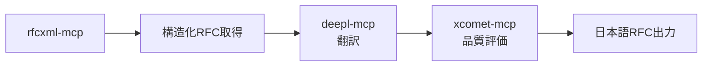

# RFCXML MCP Server - 開発ガイド

## プロジェクト概要

### 目的

RFC文書を**構造的に理解**するためのMCPサーバー。既存の`mcp-rfc`がテキストベースなのに対し、RFCXMLの意味構造を活用してAIと人間の両方がRFCを正確に理解・検証できるようにする。

### レイヤー構造

```
┌─────────────────────────┐
│  Markdown / PDF         │  表示・共有
├─────────────────────────┤
│  翻訳                   │  説明・検証・普及
├─────────────────────────┤
│  RFCXML MCP             │  AI と人の共通理解基盤 ← このプロジェクト
├─────────────────────────┤
│  RFCXML                 │  唯一の真実（Single Source of Truth）
└─────────────────────────┘
```

### 既存MCPとの差別化

| 機能 | 既存 mcp-rfc | RFCXML MCP |
|------|-------------|------------|
| RFC テキスト取得 | ✅ | ✅ |
| セクション抽出 | テキストベース | **構造ベース** |
| MUST/SHOULD/MAY 抽出 | ❌ | ✅ |
| 条件・例外の構造化 | ❌ | ✅ |
| RFC 間依存グラフ | ❌ | ✅ |
| 定義スコープ管理 | ❌ | ✅ |
| 実装チェックリスト | ❌ | ✅ |

---

## ファイル構成

```
rfcxml-mcp/
├── .github/workflows/
│   ├── ci.yml                   # CI (lint, test, build)
│   └── publish.yml              # npm publish on tags
├── src/
│   ├── index.ts                 # MCPサーバーエントリポイント
│   ├── config.ts                # 設定の一元管理
│   ├── constants.ts             # BCP 14 キーワード + RFC_NUMBER_LIMITS
│   ├── services/
│   │   ├── rfc-fetcher.ts       # RFC XML/テキスト取得（並列 + AbortController）
│   │   ├── rfc-service.ts       # RFC パース・キャッシュ管理
│   │   ├── rfcxml-parser.ts     # RFCXML パーサー
│   │   ├── rfc-text-parser.ts   # テキストフォールバックパーサー
│   │   └── checklist-generator.ts # チェックリスト生成
│   ├── tools/
│   │   ├── definitions.ts       # MCPツール定義
│   │   └── handlers.ts          # ツールハンドラー + toolHandlers Map
│   ├── types/
│   │   └── index.ts             # 型定義（ParsedRFC含む）
│   └── utils/
│       ├── cache.ts             # LRU キャッシュ
│       ├── fetch.ts             # 並列フェッチ
│       ├── logger.ts            # ログ抽象化
│       ├── requirement-extractor.ts # 要件抽出
│       ├── section.ts           # セクション検索・クロスリファレンス
│       ├── statement-matcher.ts # 重み付きマッチング
│       ├── text.ts              # テキスト処理
│       └── validation.ts        # 入力バリデーション
├── package.json
├── CHANGELOG.md                 # 変更履歴（技術的背景はこちら）
├── CLAUDE.md                    # 本ファイル
└── README.md / README.ja.md
```

---

## ツール一覧

### Phase 1: 基本構造
| ツール | 説明 |
|--------|------|
| `get_rfc_structure` | セクション階層とメタデータ取得 |
| `get_requirements` | 規範性要件（MUST/SHOULD/MAY）抽出 |
| `get_definitions` | 用語定義とスコープ |

### Phase 2: 関係性
| ツール | 説明 |
|--------|------|
| `get_rfc_dependencies` | 参照RFC（normative/informative） |
| `get_related_sections` | 関連セクション（`<xref>` + テキスト両対応）|

### Phase 3: 検証支援
| ツール | 説明 |
|--------|------|
| `generate_checklist` | 実装チェックリスト生成 |
| `validate_statement` | 主張の仕様準拠検証（重み付きマッチング + 意味的否定検出）|

### フォールバック対応
- 古いRFC (< 8650) のテキストフォールバック ✅
- ソース情報の表示 (`_source: 'xml' | 'text'`) ✅
- 精度警告の表示 (`_sourceNote`) ✅

---

## 共通パターン（`shuji-mcp-patterns` skill へ移譲）

以下の横断的実装パターンは `shuji-mcp-patterns` skill に分離済み。必要に応じて skill の該当ファイルを参照。

| パターン | Skill 内の参照先 |
|---------|------------------|
| Tool ハンドラの Map ディスパッチ（`toolHandlers`） | `handler-dispatch.md` |
| `createRequire` による `package.json` からの動的バージョン取得 | `esm-version.md` |
| `logger` 抽象化（DEBUG 対応、stderr 経由） | `logger.md` |
| `/g` フラグ正規表現のファクトリ関数パターン | `safe-regex.md` |
| `asserts` 型述語による入力検査 + 定数一元管理 | `validation.md` |
| git tag → GitHub Actions による npm publish 自動化 | `release-workflow.md` |

新規ツール追加時は、`handler-dispatch.md` のチェックリストに従うと抜け漏れが防げる。

---

## プロジェクト固有の実装ノート

### RFCXML のパース

- `fast-xml-parser` を使用
- 属性は `@_` プレフィックス、テキストノードは `#text`
- `<bcp14>` タグは XML パース前に `normalizeBcp14Tags()` で `MUST` などの素テキストに正規化（v0.4.5 で修正）
- 入れ子構造の `<references>` は `collectReferenceSections()` で再帰的にフラット化

### BCP 14 キーワードの扱い

長いキーワードから順にマッチさせる。`MUST NOT` を `MUST` より先に並べる（`src/constants.ts` の `REQUIREMENT_KEYWORDS`）。

```ts
export const REQUIREMENT_KEYWORDS: RequirementLevel[] = [
  'MUST NOT',    // MUST より先
  'MUST',
  'REQUIRED',
  'SHALL NOT',   // SHALL より先
  'SHALL',
  // ...
];
```

### RFC 番号と XML 可用性

- RFC 8650 (2019年12月) 以降は公式 RFCXML v3 が確実に利用可能
- それ以前は一部のみ利用可能（テキストフォールバック必須）

```ts
// src/config.ts
export function isRFCXMLLikelyAvailable(rfcNumber: number): boolean {
  return rfcNumber >= RFC_CONFIG.xmlAvailableFrom; // 8650
}
```

### セクション番号の正規化

XMLの `anchor` は `section-3.5` 形式、`number` は `3.5` 形式で混在するため、`src/utils/section.ts` の `normalizeSectionNumber` / `findSection` で吸収する。`get_requirements` / `generate_checklist` はどちらの形式でも受け付ける。

### `validate_statement` のマッチング方式

`src/utils/statement-matcher.ts` で重み付きキーワードマッチングを実装（v0.4.4 以降）。

- Subject terms (client, server): 重み 3
- Technical terms (request, connection): 重み 2
- Regular words: 重み 1
- Stop words: 無視
- ボーナス: 主語一致 +5、要件レベル一致 +3
- 競合検出: MAY vs MUST の矛盾検出
- 意味的否定パターン検出（v0.4.5〜）: mask/unmasked, encrypt/unencrypted 等

---

## 開発コマンド

```bash
npm install        # 依存関係インストール
npm run dev        # 開発モード（ウォッチビルド）
npm run build      # ビルド
npm test           # テスト（ウォッチ）
npm test -- --run  # テスト（単発）
npm run test:e2e   # E2E テスト（MCP クライアント統合）
npm run lint       # リント
npm run format     # フォーマット
npm start          # MCP サーバー起動
```

`DEBUG=1 npm start` で詳細ログ出力。

---

## テスト

| ファイル | 対象 |
|----------|------|
| `handlers.test.ts` | ツールハンドラー統合 |
| `rfcxml-parser.test.ts` | XML パーサー（bcp14 / xref 対応含む） |
| `rfc-text-parser.test.ts` | テキストパーサー |
| `cache.test.ts` | LRU キャッシュ |
| `validation.test.ts` | RFC 番号バリデーション |
| `statement-matcher.test.ts` | 重み付きマッチング + 意味的否定 |
| `requirement-extractor.test.ts` | 要件フィルタリング |

実行:

```bash
npm test -- --run           # 単発実行
npm test -- --coverage      # カバレッジ
```

### テスト用 RFC

| RFC | 内容 | XML状態 |
|-----|------|---------|
| 9293 | TCP (2022) | ✅ 利用可能 |
| 9110 | HTTP Semantics (2022) | ✅ 利用可能 |
| 6455 | WebSocket (2011) | ❌ XML なし（テキストフォールバック） |
| 7230 | HTTP/1.1 (2014) | ❌ XML なし |

---

## MCP 設定（開発時）

```json
{
  "mcpServers": {
    "rfcxml-mcp-dev": {
      "command": "node",
      "args": ["/path/to/rfcxml-mcp/dist/index.js"]
    }
  }
}
```

ユーザー向けインストール方法は README.md を参照。

---

## 変更履歴と技術的背景

過去のバージョンで解決した技術的課題（i18n 対応、バージョン同期バグ、`<bcp14>` タグ処理、意味的否定検出など）の詳細は [CHANGELOG.md](./CHANGELOG.md) を参照。CLAUDE.md では**現在の設計の要点**のみを記載する方針。

---

## 今後の拡張構想

### RFC翻訳ワークフローとの連携


```mermaid
graph LR
    A[rfcxml-mcp] --> B[構造化RFC取得]
    B --> C[deepl-mcp<br/>翻訳]
    C --> D[xcomet-mcp<br/>品質評価]
    D --> E[日本語RFC出力]
```

### 検討中の機能

- 意味的類似度による検索（埋め込みベクトル）
- LLM を使った validate_statement の精度向上

---

## 関連プロジェクト

- [mjpitz/mcp-rfc](https://github.com/mjpitz/mcp-rfc) - テキストベースの RFC MCP
- [tizee/mcp-server-ietf](https://github.com/tizee/mcp-server-ietf) - RFC 取得 MCP
- [ietf-tools/RFCXML](https://github.com/ietf-tools/RFCXML) - RFCXML スキーマ

### 参考仕様

- RFCXML v3 仕様: RFC 7991
- BCP 14 キーワード: RFC 2119, RFC 8174
- RFCXML 語彙: https://authors.ietf.org/rfcxml-vocabulary
